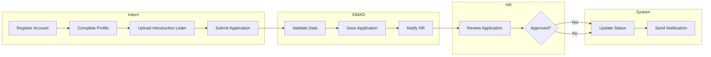
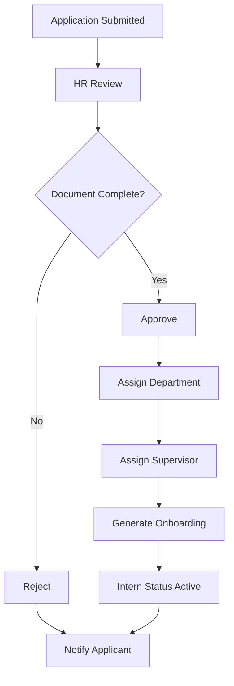
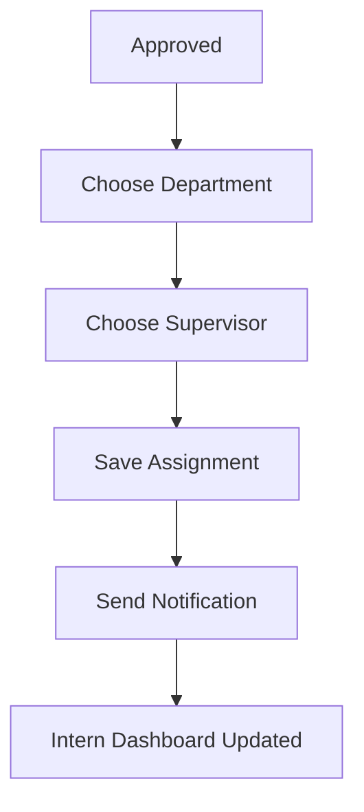
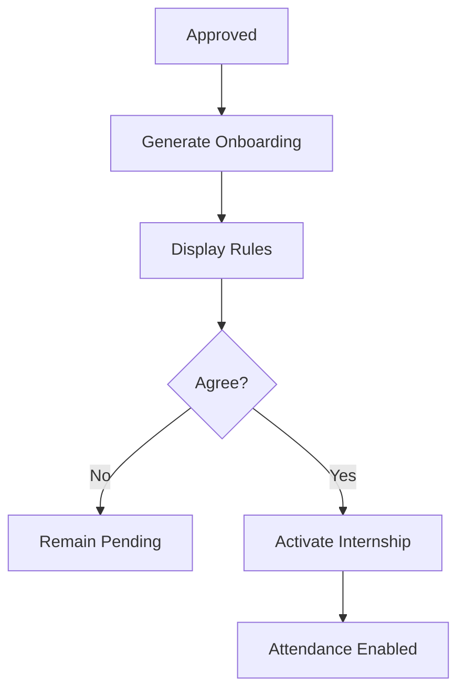
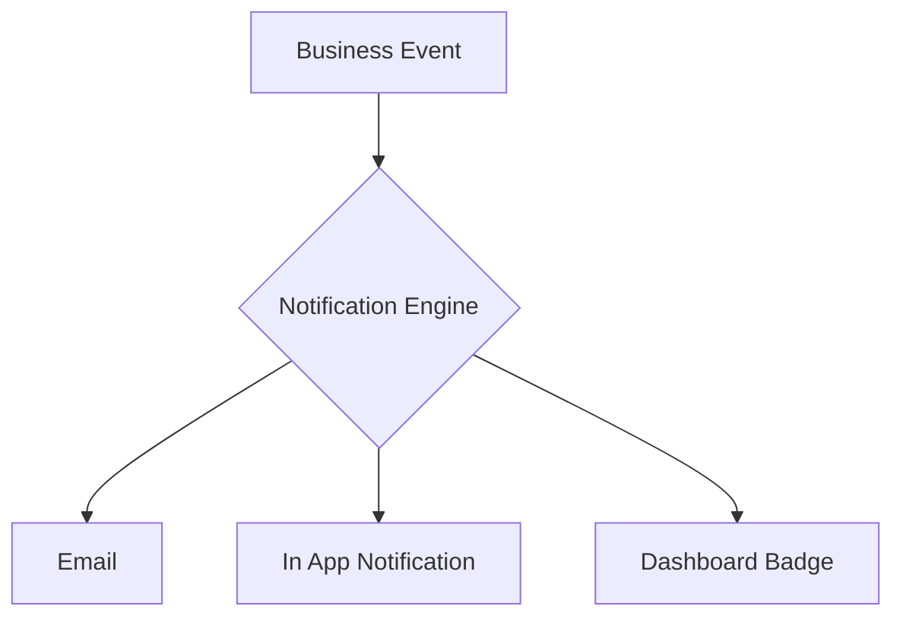
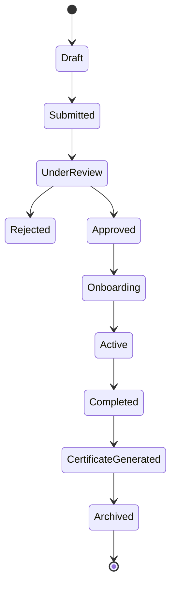

# 02. Business Process (Part 2)

> Swimlane, Workflow, Activity Flow, Business Rules

---

# 7. Swimlane Diagram

Swimlane Diagram menggambarkan tanggung jawab masing-masing aktor selama proses administrasi magang.

## Actors

- Peserta Magang
- Sistem SIMAD
- Admin HR
- Supervisor

---

## 7.1 Internship Registration

---

# Description

| Actor  | Responsibility       |
| ------ | -------------------- |
| Intern | Mengajukan magang    |
| SIMAD  | Memvalidasi data     |
| HR     | Approval atau Reject |
| System | Mengirim notifikasi  |

---

# 8. Approval Workflow

Approval dilakukan oleh Admin HR setelah memeriksa seluruh dokumen peserta.

---

## Approval Flow

---

## Approval States

| State        | Description         |
| ------------ | ------------------- |
| Draft        | Data belum dikirim  |
| Submitted    | Menunggu review     |
| Under Review | Sedang diperiksa HR |
| Approved     | Diterima            |
| Rejected     | Ditolak             |
| Active       | Sedang Magang       |
| Completed    | Magang selesai      |
| Archived     | Data diarsipkan     |

---

# Business Rules

### HR hanya dapat melakukan approval apabila:

- Profil telah lengkap.
- Surat pengantar berhasil diunggah.
- Tanggal mulai dan selesai valid.
- Supervisor tersedia.
- Bidang telah dipilih.

---

# 9. Assignment Workflow

Setelah approval selesai, peserta akan ditempatkan pada bidang tertentu.

---

## Assignment Rules

- Satu peserta hanya boleh memiliki satu supervisor aktif.
- Satu peserta hanya boleh berada pada satu bidang aktif.
- Supervisor hanya dapat berasal dari bidang yang sama.
- Perubahan supervisor harus tercatat pada Audit Log.

---

# 10. Digital Onboarding Workflow

Setelah peserta disetujui, sistem akan memberikan onboarding digital.

---

## Onboarding Checklist

Peserta wajib membaca informasi berikut.

- Jam Kerja
- Tata Tertib
- Dress Code
- Peraturan Keselamatan
- Etika Kerja
- Kontak Supervisor
- Lokasi Penempatan

---

## Business Rules

Peserta tidak dapat melakukan absensi apabila belum menyelesaikan proses onboarding.

---

# 11. Notification Workflow

Sistem akan mengirim notifikasi secara otomatis berdasarkan event tertentu.

---

## Trigger Event

| Event                 | Recipient |
| --------------------- | --------- |
| Register Success      | Intern    |
| Email Verification    | Intern    |
| Application Submitted | HR        |
| Approved              | Intern    |
| Rejected              | Intern    |
| Supervisor Assigned   | Intern    |
| Reminder Check In     | Intern    |
| Reminder Check Out    | Intern    |
| Attendance Invalid    | Intern    |
| Certificate Ready     | Intern    |

---

# 12. Activity Diagram

## Internship Lifecycle

---

# State Description

| State                 | Description         |
| --------------------- | ------------------- |
| Draft                 | Belum submit        |
| Submitted             | Menunggu review     |
| Under Review          | Diproses HR         |
| Approved              | Diterima            |
| Onboarding            | Membaca tata tertib |
| Active                | Sedang magang       |
| Completed             | Masa magang selesai |
| Certificate Generated | Sertifikat dibuat   |
| Archived              | Arsip               |

---

# 13. Decision Table

## Approval Decision

| Condition                 | Result          |
| ------------------------- | --------------- |
| Data lengkap              | Continue Review |
| Surat tidak ada           | Reject          |
| Email belum verifikasi    | Pending         |
| Supervisor belum tersedia | Hold            |
| Bidang belum dipilih      | Hold            |
| Semua valid               | Approve         |

---

# 14. Business Rules Summary

## Registration

- Email harus unik.
- Surat wajib format PDF.
- Maksimum ukuran file 5 MB.
- Tanggal mulai harus lebih kecil dari tanggal selesai.

---

## Approval

- Hanya HR yang dapat melakukan approval.
- Approval menghasilkan Audit Log.
- Approval memicu notifikasi.
- Approval mengaktifkan onboarding.

---

## Assignment

- Supervisor hanya satu.
- Bidang hanya satu.
- Penempatan dapat diubah sebelum status Active.

---

## Onboarding

- Wajib diselesaikan sebelum absensi pertama.
- Persetujuan onboarding disimpan sebagai bukti digital.

---

# Next Section

Pada **Part 3** akan dibahas modul yang menjadi inti sistem:

- Attendance Workflow
- GPS Validation Workflow
- Time Validation
- Fake GPS Prevention
- Supervisor Override
- Attendance State Machine
- Attendance Exception Flow
- Attendance Decision Table
- Attendance Business Rules

Bagian ini merupakan inti dari SIMAD karena menjadi pembeda utama dibandingkan sistem administrasi magang konvensional.
