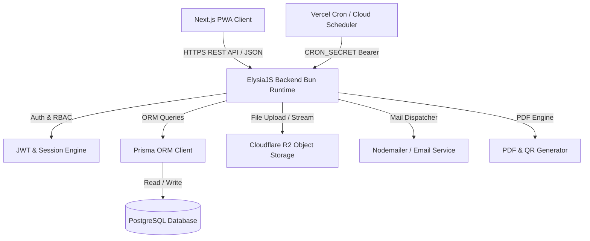
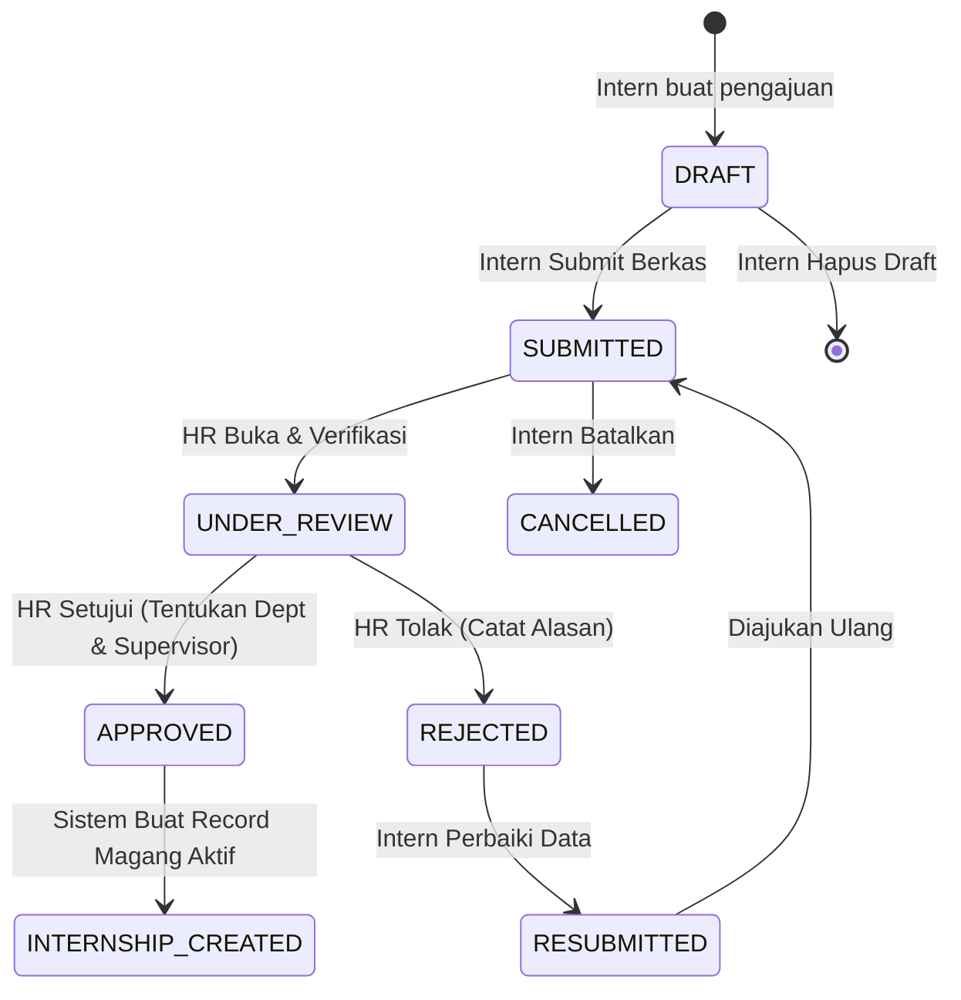
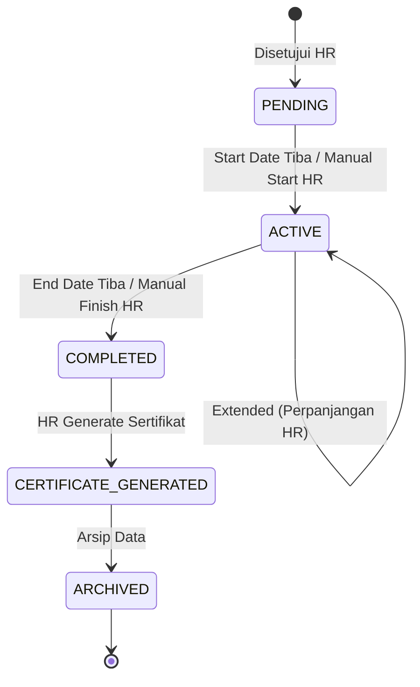
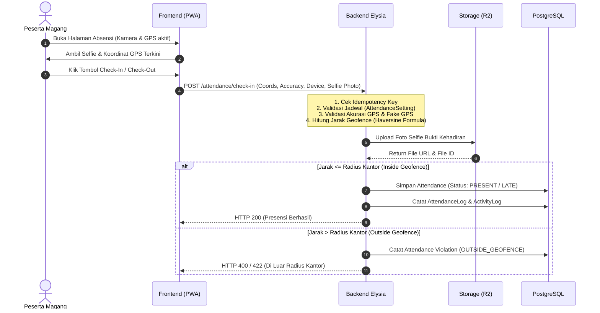

# RESUME DOKUMENTASI SISTEM SIMAD VERSION 1.0.0
> **Sistem Informasi Manajemen Magang & Absensi Digital (SIMAD)**  
> **Versi:** 1.0.0 (Stable Release)  
> **Target Entitas:** Lingkungan PLN Persero / Unit Pelaksana  
> **Tanggal Rilis Dokumen:** September 2026  
> **Status:** Production Ready (Baseline v1.0.0)

---

## DAFTAR ISI
1. [Ringkasan Eksekutif (Executive Summary)](#1-ringkasan-eksekutif-executive-summary)
2. [Arsitektur Sistem & Tech Stack](#2-arsitektur-sistem--tech-stack)
3. [Matriks Peran Pengguna (User Roles & Permissions)](#3-matriks-peran-pengguna-user-roles--permissions)
4. [Mekanisme & Alur Bisnis End-to-End (Business Workflows)](#4-mekanisme--alur-bisnis-end-to-end-business-workflows)
   - 4.1. [Alur Autentikasi & Keamanan Sesi](#41-alur-autentikasi--keamanan-sesi)
   - 4.2. [Alur Pengajuan Magang (Internship Application)](#42-alur-pengajuan-magang-internship-application)
   - 4.3. [Alur Digital Onboarding Peserta](#43-alur-digital-onboarding-peserta)
   - 4.4. [Alur Siklus Hidup Magang (Internship Lifecycle)](#44-alur-siklus-hidup-magang-internship-lifecycle)
   - 4.5. [Alur Penempatan & Penugasan Supervisor](#45-alur-penempatan--penugasan-supervisor)
   - 4.6. [Alur Absensi Digital & Geofencing GPS](#46-alur-absensi-digital--geofencing-gps)
   - 4.7. [Alur Supervisor Override & Penanganan Pelanggaran](#47-alur-supervisor-override--penanganan-pelanggaran)
   - 4.8. [Alur Penerbitan & Verifikasi Sertifikat Digital](#48-alur-penerbitan--verifikasi-sertifikat-digital)
   - 4.9. [Alur Notifikasi & Broadcast Sistem](#49-alur-notifikasi--broadcast-sistem)
   - 4.10. [Alur Otomatisasi Cron & Background Jobs](#410-alur-otomatisasi-cron--background-jobs)
5. [Katalog Lengkap API Endpoint yang Terimplementasi](#5-katalog-lengkap-api-endpoint-yang-terimplementasi)
   - 5.1. [Modul Autentikasi (`/auth`)](#51-modul-autentikasi-auth)
   - 5.2. [Modul Manajemen User & Profil (`/users`)](#52-modul-manajemen-user--profil-users)
   - 5.3. [Modul Pengajuan Magang (`/applications`)](#53-modul-pengajuan-magang-applications)
   - 5.4. [Modul Magang & Skill Profil (`/internships`)](#54-modul-magang--skill-profil-internships)
   - 5.5. [Modul Absensi & Geofencing (`/attendance`)](#55-modul-absensi--geofencing-attendance)
   - 5.6. [Modul Sertifikat Digital (`/certificates`)](#56-modul-sertifikat-digital-certificates)
   - 5.7. [Modul Supervisor (`/supervisors`)](#57-modul-supervisor-supervisors)
   - 5.8. [Modul Resepsionis (`/receptionists`)](#58-modul-resepsionis-receptionists)
   - 5.9. [Modul Dashboard Analitik (`/intern/dashboard`, `/hr-admin/dashboard`, `/supervisor/dashboard`, `/receptionist/dashboard`)](#59-modul-dashboard-analitik)
   - 5.10. [Modul Laporan & Ekspor (`/reports`)](#510-modul-laporan--ekspor-reports)
   - 5.11. [Modul Notifikasi (`/notifications`)](#511-modul-notifikasi-notifications)
   - 5.12. [Modul Departemen / Divisi (`/departments`)](#512-modul-departemen--divisi-departments)
   - 5.13. [Modul Lokasi Kantor & Geofence (`/offices`)](#513-modul-lokasi-kantor--geofence-offices)
   - 5.14. [Modul Institusi Pendidikan (`/institutions`)](#514-modul-institusi-pendidikan-institutions)
   - 5.15. [Modul Penyimpanan File (`/files`)](#515-modul-penyimpanan-file-files)
   - 5.16. [Modul Jejak Audit (`/audit-logs`)](#516-modul-jejak-audit-audit-logs)
   - 5.17. [Modul Cron & Pembersihan Otomatis (`/cron`)](#517-modul-cron--pembersihan-otomatis-cron)
6. [Struktur Basis Data & Model Prisma](#6-struktur-basis-data--model-prisma)
7. [Fitur Frontend & Pengalaman Pengguna (UI/UX)](#7-fitur-frontend--pengalaman-pengguna-uiux)
8. [Fondasi & Panduan untuk Perkembangan Fitur Selanjutnya (v1.1.0+)](#8-fondasi--panduan-untuk-perkembangan-fitur-selanjutnya-v110)

---

# 1. Ringkasan Eksekutif (Executive Summary)

**SIMAD (Sistem Informasi Manajemen Magang & Absensi Digital)** v1.0.0 adalah platform web terintegrasi yang mendigitalisasi seluruh proses operasional magang dari hulu ke hilir (end-to-end) di lingkungan PLN Persero. 

### Transformasi Proses Bisnis (AS-IS vs TO-BE)
* **Sebelumnya (AS-IS):** Pengajuan fisik via loket, verifikasi manual bertumpuk di berkas kertas, ketiadaan validasi absensi harian yang akurat (tanpa bukti koordinat GPS/foto), pembuatan sertifikat satu per satu manual di software dokumen yang rentan typo, serta absennya histori monitoring kehadiran real-time bagi supervisor unit.
* **SIMAD v1.0.0 (TO-BE):** Seluruh pendaftaran dilakukan online, verifikasi dokumen dan penetapan bidang oleh HR terintegrasi dalam dashboard, onboarding digital anti-sengketa aturan, absensi GPS Geofencing radius meter dengan verifikasi selfie & anti-fake GPS, override absensi oleh supervisor berwenang, penerbitan sertifikat PDF instan otomatis dilengkapi QR Code & Token Verifikasi publik, serta rekap ekspor Excel otomatis.

---

# 2. Arsitektur Sistem & Tech Stack



### 1. Backend Stack
* **Runtime:** [Bun](https://bun.sh) (High-performance JavaScript/TypeScript runtime).
* **Framework:** [ElysiaJS](https://elysiajs.com) (Type-safe, modern web framework).
* **Database ORM:** [Prisma ORM](https://www.prisma.io) dengan database PostgreSQL.
* **File Storage:** Cloudflare R2 / AWS S3 API kompatibel untuk penyimpanan berkas surat pengantar, foto selfie presensi, avatar, template sertifikat, dan PDF sertifikat yang diterbitkan.
* **Authentication & Cryptography:** JWT (`accessToken` + `refreshToken`), Google OAuth 2.0 Token Verification, Magic Link crypto tokens, Argon2/Bcrypt password hashing.
* **Security & Reliability:**
  * In-memory sliding-window **Rate Limiter** per IP / User ID.
  * **Idempotency Middleware** berbasis header `x-idempotency-key` untuk mencegah double submission pada aksi krusial (check-in, approve, generate sertifikat).
  * **Role-Based Access Control (RBAC)** middleware.
  * Internal API Key guard.
  * Comprehensive **Audit Logging** dan **Activity Logging**.
* **Document Engine:** `pdfkit` / PDF Generator dengan pembuatan QR Code verifikasi dinamis, `exceljs` untuk export rekap presensi.

### 2. Frontend Stack
* **Framework:** Next.js (App Router) + React + TypeScript.
* **State & Server Cache:** `@tanstack/react-query` (React Query v5) dengan arsitektur custom API hook layer (`api.<module>.<query/mutate>`).
* **Form & Validation:** `react-hook-form` terintegrasi dengan validasi skema.
* **PWA (Progressive Web App):** Service Worker, Manifest, Install prompt banner, Offline alert fallback.
* **Device Features:** HTML5 Geolocation API, MediaDevices Camera Capture (Selfie presensi), Image Cropper.
* **UI/UX Design:** Atomic design pattern (Atoms, Organisms, Pages, Wrappers), responsive layouts, modern status badges, and interactive dashboard charts.

---

# 3. Matriks Peran Pengguna (User Roles & Permissions)

Sistem SIMAD v1.0.0 mendukung 4 peran pengguna terotentikasi dan 1 peran publik:

| Fitur / Modul | Public / Guest | Intern (Peserta) | Supervisor | HR Admin | Receptionist |
| :--- | :---: | :---: | :---: | :---: | :---: |
| **Registrasi & Login Akun** | ✅ | ✅ | ✅ | ✅ | ✅ |
| **Login Google & Magic Link** | ✅ | ✅ | - | - | - |
| **Verifikasi Sertifikat (QR)** | ✅ | ✅ | ✅ | ✅ | ✅ |
| **Lengkapi Profil & Unggah Berkas** | - | ✅ | - | - | - |
| **Ajukan & Batalkan Magang** | - | ✅ | - | - | - |
| **Persetujuan Digital Onboarding** | - | ✅ | - | - | - |
| **Presensi GPS (Check-in / Check-out)** | - | ✅ | - | - | - |
| **Lihat Riwayat & Summary Absensi** | - | ✅ (Milik Sendiri) | ✅ (Bimbingan) | ✅ (Semua) | - |
| **Unduh Sertifikat Magang** | - | ✅ (Milik Sendiri) | ✅ (Bimbingan) | ✅ (Semua) | - |
| **Approve / Reject Pengajuan Magang** | - | - | - | ✅ | - |
| **Monitoring Dashboard Magang & Presensi** | - | ✅ (Intern View) | ✅ (Unit View) | ✅ (Global View) | ✅ (Front Desk) |
| **Override / Koreksi Status Absensi** | - | - | ✅ (Unit Terkait) | - | - |
| **Manajemen Penempatan & Supervisor** | - | - | - | ✅ | - |
| **Generate & Pengaturan Sertifikat** | - | - | - | ✅ | - |
| **Manajemen Master Data (Dept, Kantor, dll)**| - | - | - | ✅ | - |
| **Manajemen Akun Supervisor & Resepsionis** | - | - | - | ✅ | - |
| **Lihat & Ekspor Laporan Excel** | - | ✅ (Milik Sendiri) | ✅ (Bimbingan) | ✅ (Semua) | - |
| **Inspeksi Jejak Audit (Audit Log)** | - | - | - | ✅ | - |

---

# 4. Mekanisme & Alur Bisnis End-to-End (Business Workflows)

## 4.1. Alur Autentikasi & Keamanan Sesi
1. **Registrasi Akun:** Calon peserta mendaftar dengan nama, email, dan password. Sistem membuat status user dan mengirimkan email verifikasi berisi token.
2. **Verifikasi Email:** Pengguna mengklik tautan/memasukkan token verifikasi email (`/auth/verify-email`) untuk mengaktifkan akun.
3. **Login Alternatif:** 
   * **Google OAuth:** Pengguna dapat login via Google ID token. Jika email belum ada di database, sistem membuat akun otomatis dengan peran `INTERN`.
   * **Magic Link:** Pengguna dapat meminta tautan login instan tanpa password yang dikirim ke email terdaftar.
4. **Session Management & Refresh Token:**
   * Login sukses menghasilkan `accessToken` (short-lived) dan `refreshToken` (long-lived) yang dicatat pada tabel `refresh_tokens`.
   * Sistem mendeteksi metadata login (perangkat, platform, browser, IP address).
   * Pengguna dapat melihat daftar sesi aktif (`/auth/sessions`) dan melakukan pencabutan sesi tertentu atau seluruh sesi (`logout-all`).

## 4.2. Alur Pengajuan Magang (Internship Application)



1. **Pengisian Draft (`DRAFT`):** Calon peserta yang profilnya telah lengkap mengunggah berkas surat pengantar universitas/sekolah, memilih kantor tujuan, menentukan rentang tanggal magang, dan mengisi motivasi.
2. **Pengajuan Berkas (`SUBMITTED`):** Peserta melakukan finalisasi submit. Sistem mengunci data draft dan men-generate nomor registrasi resmi unik berformat `APP-YYYYMMDD-XXXX`.
3. **Pemeriksaan HR (`UNDER_REVIEW`):** HR Admin dan Resepsionis dapat melihat pengajuan masuk. HR melakukan verifikasi kelayakan dokumen, ketersediaan kuota departemen, dan legalitas surat pengantar.
4. **Keputusan HR:**
   * **Tolak (`REJECTED`):** HR wajib menyertakan alasan penolakan. Peserta menerima notifikasi/email dan berhak mengajukan ulang revisi (`RESUBMITTED`).
   * **Setujui (`APPROVED`):** HR menentukan penempatan unit kerja (**Departemen**), menugaskan **Supervisor Pembimbing**, dan memastikan **Lokasi Kantor**.
5. **Penciptaan Magang (`INTERNSHIP_CREATED`):** Begitu status menjadi `APPROVED`, sistem secara otomatis membuat entitas `Internship` berstatus `PENDING` dan relasi `SupervisorAssignment`.

## 4.3. Alur Digital Onboarding Peserta
* Sebelum peserta magang berstatus `ACTIVE` dapat melakukan absensi, mereka wajib melalui alur Digital Onboarding pada aplikasi.
* Peserta membaca materi pengenalan, pakta integritas, tata tertib jam kerja PLN, dan kebijakan K3.
* Peserta mengklik persetujuan digital. Sistem mencatat persetujuan ke tabel `onboarding_histories` dengan merekam timestamp, IP Address, dan User-Agent sebagai bukti hukum kepatuhan tata tertib. Kolom `onboarding_completed` pada internship diubah menjadi `true`.

## 4.4. Alur Siklus Hidup Magang (Internship Lifecycle)



1. **`PENDING`:** Masa tunggu sebelum tanggal mulai magang (`actualStartDate`) dimulai dan menunggu onboarding diselesaikan.
2. **`ACTIVE`:** Peserta aktif bekerja dan fitur presensi harian terbuka. Perubahan ke status ini dapat dipicu otomatis oleh jadwal cron harian pada tanggal mulai atau dijalankan manual oleh HR Admin.
3. **`COMPLETED`:** Periode magang berakhir (`actualEndDate`). Akses presensi otomatis terkunci.
4. **`CERTIFICATE_GENERATED`:** Sertifikat kelulusan magang telah diterbitkan oleh HR.
5. **`ARCHIVED`:** Seluruh riwayat magang dikunci dan diarsipkan untuk kebutuhan audit jangka panjang.

## 4.5. Alur Penempatan & Penugasan Supervisor
* HR Admin memiliki kendali penuh untuk:
  * Memindahkan departemen peserta magang (`PATCH /internships/:id/change-department`) dengan riwayat perubahan yang tercatat di audit log.
  * Menugaskan, mengganti, atau mengakhiri penugasan supervisor (`SupervisorAssignment`) kapan saja.
  * Supervisor yang ditugaskan akan langsung mendapatkan akses monitoring daftar anak bimbingannya secara real-time.

## 4.6. Alur Absensi Digital & Geofencing GPS



### Aturan & Logika Bisnis Presensi:
1. **Formula Geofencing:** Menggunakan **Haversine Formula** untuk menghitung jarak presisi (dalam meter) antara koordinat GPS peserta dengan titik koordinat `OfficeLocation`.
2. **Batas Radius:** Peserta dinyatakan valid berada di kantor jika `Distance <= RadiusMeter` (konfigurasi per kantor, default 50-100 meter).
3. **Validasi Waktu (Window Schedule):**
   * **Check-In Start & End:** Batas waktu absensi masuk (misal 06:00 - 10:00 WIB).
   * **Late Threshold:** Jika check-in melebihi waktu toleransi (misal setelah 08:00 WIB), status otomatis ditandai `LATE`.
   * **Check-Out Start & End:** Batas waktu absensi pulang (misal 16:00 - 21:00 WIB).
   * **Work Minutes:** Saat check-out, sistem otomatis menghitung `totalWorkMinutes`.
4. **Deteksi Kecurangan (Fraud Prevention):**
   * Deteksi Fake GPS / mock location / akurasi abnormal.
   * Wajib melampirkan foto selfie real-time kamera (bukan upload galeri).
   * Pencatatan `fingerprint`, `userAgent`, `platform`, dan `ipAddress`.
   * Status kehadiran yang didukung: `PRESENT`, `LATE`, `COMPLETED`, `PENDING_REVIEW`, `INVALID`, `ABSENT`.

## 4.7. Alur Supervisor Override & Penanganan Pelanggaran
* **Attendance Override:** Jika terjadi kendala jaringan, tugas dinas luar kantor, atau kesalahan sistem, **Supervisor** berwenang melakukan koreksi status kehadiran (`PATCH /attendance/:id/override`) menjadi `PRESENT` atau `INVALID` dengan wajib menyertakan alasan. Perubahan ini dicatat transparan di tabel `attendance_overrides`.
* **Attendance Violation:** Pelanggaran seperti `FAKE_GPS`, `OUTSIDE_GEOFENCE`, `MULTIPLE_CHECK_IN`, `DEVICE_MANIPULATION`, `LATE_ATTENDANCE`, atau `EARLY_CHECK_OUT` dicatat dalam `attendance_violations` dan dapat ditinjau serta diselesaikan (`resolved`) oleh supervisor/HR.

## 4.8. Alur Penerbitan & Verifikasi Sertifikat Digital
1. **Syarat Kelayakan:** Magang berstatus `COMPLETED` dan telah menyelesaikan seluruh masa kerja.
2. **Penerbitan PDF (HR Admin):** HR menekan tombol *Generate Certificate*. Sistem memicu engine PDF untuk:
   * Mengambil data nama peserta, NIM, institusi, departemen, dan durasi magang.
   * Mengambil konfigurasi penandatangan (*Signer Name*, *Signer Role*, dan gambar tanda tangan digital/stempel dari `CertificateSettings`).
   * Men-generate **Nomor Sertifikat Unik** berstandar korporat.
   * Men-generate **Verification Token** dan **QR Code** verifikasi publik.
   * Menyusun dokumen PDF beresolusi tinggi dan mengunggahnya ke Cloudflare R2 Storage.
3. **Verifikasi Publik:** Publik, pihak kampus, atau perusahaan perekrut dapat memindai QR Code sertifikat yang mengarah ke endpoint publik `GET /certificates/verify/:token` untuk memvalidasi keaslian dokumen tanpa perlu login ke sistem.

## 4.9. Alur Notifikasi & Broadcast Sistem
* **Notifikasi Transaksional:** Terkirim otomatis saat pengajuan disetujui, ditolak, magang aktif, supervisor ditugaskan, atau sertifikat terbit.
* **Broadcast Pengumuman:** HR Admin dapat mengirimkan pengumuman broadcast kepada seluruh peserta aktif atau peran tertentu.
* **Unread Tracker:** Sistem menghitung jumlah notifikasi belum dibaca secara real-time dengan penanda `read_at`.

## 4.10. Alur Otomatisasi Cron & Background Jobs
Endpoint `/api/v1/cron` diamankan menggunakan token `CRON_SECRET` untuk otomatisasi:
1. **`GET|POST /cron/internship`:** Otomatis mengubah status `PENDING` -> `ACTIVE` saat `actualStartDate` tercapai, dan `ACTIVE` -> `COMPLETED` saat `actualEndDate` terlewati.
2. **`GET|POST /cron/ping` & `/warmup`:** Database & API keep-alive ping untuk mencegah cold-start latency.
3. **`GET|POST /cron/cleanup/users`:** Pembersihan data akun yang tidak aktif atau telah kadaluwarsa masa tunggunya.
4. **`GET|POST /cron/cleanup/files`:** Menghapus file orphaned yang tidak lagi terikat pada entity manapun di storage.

---

# 5. Katalog Lengkap API Endpoint yang Terimplementasi

Seluruh API menggunakan prefix dasar: `/api/v1`

---

## 5.1. Modul Autentikasi (`/auth`)

| No | HTTP Method | Endpoint Path | Auth & Role | Deskripsi Singkat & Rules |
| :--- | :--- | :--- | :--- | :--- |
| 1 | `POST` | `/auth/register` | Public (Rate Limited) | Registrasi akun baru (Nama, Email, Password). Mengirim email verifikasi. |
| 2 | `POST` | `/auth/verify-email/send`| Public | Kirim ulang token verifikasi ke email pengguna. |
| 3 | `POST` | `/auth/verify-email` | Public | Verifikasi email menggunakan token aktivasi. |
| 4 | `POST` | `/auth/login` | Public (Rate Limited) | Autentikasi email & password. Mengembalikan accessToken & refreshToken. |
| 5 | `POST` | `/auth/oauth` | Public (Rate Limited) | Login/Register instan menggunakan Google ID Token (Credential). |
| 6 | `POST` | `/auth/magic-link/send` | Public (Rate Limited) | Kirim tautan login sekali pakai (Magic Link) ke email pengguna. |
| 7 | `POST` | `/auth/magic-link/verify`| Public | Verifikasi token magic link dan generate sesi login JWT. |
| 8 | `POST` | `/auth/forgot-password` | Public (Rate Limited) | Mengirim instruksi & token reset password ke email. |
| 9 | `POST` | `/auth/reset-password` | Public | Mereset password pengguna dengan token valid. |
| 10| `POST` | `/auth/refresh-token` | Public | Menukar `refreshToken` lama dengan `accessToken` baru. |
| 11| `POST` | `/auth/logout` | Bearer Token | Logout dan mencabut sesi token aktif saat ini. |
| 12| `POST` | `/auth/logout-all` | Bearer Token | Logout massal dari seluruh perangkat aktif pengguna. |
| 13| `GET`  | `/auth/me` | Bearer Token | Mengambil detail profil user login, role aktif, dan relasi profil. |
| 14| `PATCH`| `/auth/change-password` | Bearer Token | Mengubah password akun login (wajib menyertakan old password). |
| 15| `PATCH`| `/auth/change-email` | Bearer Token | Mengajukan email baru dan mengirimkan kode verifikasi ke email baru. |
| 16| `POST` | `/auth/change-email/verify`| Bearer Token | Konfirmasi pergantian email dengan token verifikasi. |
| 17| `GET`  | `/auth/sessions` | Bearer Token | Melihat seluruh sesi login perangkat aktif pengguna. |
| 18| `DELETE`| `/auth/sessions/:sessionId`| Bearer Token | Menghentikan/mencabut sesi login pada perangkat tertentu. |

---

## 5.2. Modul Manajemen User & Profil (`/users`)

| No | HTTP Method | Endpoint Path | Auth & Role | Deskripsi Singkat & Rules |
| :--- | :--- | :--- | :--- | :--- |
| 19| `GET`  | `/users/profile` | `intern`, `hr_admin`, `supervisor`, `receptionist` | Mengambil data profil lengkap pengguna yang sedang aktif. |
| 20| `PATCH`| `/users/profile` | `intern`, `hr_admin`, `supervisor` | Update data umum profil (Nama Lengkap, Telepon, dsb). |
| 21| `POST` | `/users/profile/photo` | Authenticated (Rate Limited) | Upload dan ganti foto avatar profil (JPG/PNG maks 5MB). |
| 22| `PATCH`| `/users/change-password` | Authenticated | Endpoint alternatif ubah password profil. |
| 23| `DELETE`| `/users/delete-account` | Authenticated | Permintaan penghapusan akun mandiri. |

---

## 5.3. Modul Pengajuan Magang (`/applications`)

| No | HTTP Method | Endpoint Path | Auth & Role | Deskripsi Singkat & Rules |
| :--- | :--- | :--- | :--- | :--- |
| 24| `POST` | `/applications` | `intern` | Membuat draft pengajuan magang baru beserta upload surat pengantar. |
| 25| `GET`  | `/applications/me` | `intern` | Mengambil daftar riwayat pengajuan magang milik intern sendiri. |
| 26| `PATCH`| `/applications/:id` | `intern` | Memperbarui data pada pengajuan magang yang masih berstatus DRAFT. |
| 27| `POST` | `/applications/:id/submit` | `intern` | Finalisasi submit berkas pengajuan magang ke HR (`DRAFT` -> `SUBMITTED`). |
| 28| `POST` | `/applications/:id/cancel` | `intern` | Membatalkan pengajuan magang yang telah dikirim. |
| 29| `DELETE`| `/applications/:id` | `intern` | Menghapus data draft pengajuan magang. |
| 30| `GET`  | `/applications` | `hr_admin`, `receptionist` | Daftar seluruh pengajuan magang masuk (Filter status, pagination, search). |
| 31| `GET`  | `/applications/:id` | `hr_admin`, `supervisor`, `intern`, `receptionist` | Detail lengkap pengajuan magang beserta berkas lampiran. |
| 32| `PATCH`| `/applications/:id/approve` | `hr_admin` (Idempotent) | Menyetujui pengajuan, menugaskan departemen, kantor, & supervisor. |
| 33| `PATCH`| `/applications/:id/reject` | `hr_admin` (Idempotent) | Menolak pengajuan magang dengan menyertakan alasan penolakan. |

---

## 5.4. Modul Magang & Skill Profil (`/internships`)

| No | HTTP Method | Endpoint Path | Auth & Role | Deskripsi Singkat & Rules |
| :--- | :--- | :--- | :--- | :--- |
| 34| `GET`  | `/internships/me` | `intern` | Mengambil data magang aktif peserta beserta detail penempatan. |
| 35| `GET`  | `/internships` | `hr_admin`, `receptionist` | Daftar seluruh peserta magang (filter status: PENDING, ACTIVE, COMPLETED). |
| 36| `GET`  | `/internships/:id` | `hr_admin`, `supervisor`, `receptionist` | Detail data magang peserta tertentu. |
| 37| `PATCH`| `/internships/:id/start` | `hr_admin` | Mengaktifkan magang secara manual (`PENDING` -> `ACTIVE`). |
| 38| `PATCH`| `/internships/:id/finish`| `hr_admin` (Idempotent) | Menyelesaikan magang secara manual (`ACTIVE` -> `COMPLETED`). |
| 39| `PATCH`| `/internships/:id/extend`| `hr_admin` | Memperpanjang tanggal berakhir magang (`actualEndDate`). |
| 40| `PATCH`| `/internships/:id/assign-supervisor`| `hr_admin` | Menugaskan atau mengganti pembimbing lapangan peserta. |
| 41| `PATCH`| `/internships/:id/change-department`| `hr_admin` | Memindahkan divisi/bidang kerja peserta magang. |
| 42| `PATCH`| `/internships/:id/archive`| `hr_admin` | Mengarsipkan data magang peserta yang telah selesai. |
| 43| `POST` | `/internships/profile` | `intern` | Mengisi/melengkapi data profil intern (NIM, Institusi, Jurusan, Alamat). |
| 44| `GET`  | `/internships/profile` | `intern` | Mengambil data profil biodata intern. |
| 45| `GET`  | `/internships/skill` | Authenticated | Mengambil seluruh master keahlian (skills catalog). |
| 46| `POST` | `/internships/skill` | `hr_admin`, `supervisor` | Menambah master keahlian baru ke sistem. |
| 47| `PUT`  | `/internships/skill/:id`| `hr_admin`, `supervisor` | Mengubah nama atau kategori master keahlian. |
| 48| `DELETE`| `/internships/skill/:id`| `hr_admin`, `supervisor` | Menghapus master keahlian dari sistem. |
| 49| `POST` | `/internships/add-skills`| `intern` | Menambahkan keahlian ke profil peserta magang. |
| 50| `DELETE`| `/internships/remove-skill/:skillId`| `intern` | Menghapus keahlian dari profil peserta magang. |

---

## 5.5. Modul Absensi & Geofencing (`/attendance`)

| No | HTTP Method | Endpoint Path | Auth & Role | Deskripsi Singkat & Rules |
| :--- | :--- | :--- | :--- | :--- |
| 51| `POST` | `/attendance/check-in` | `intern` (Rate Limited & Idempotent) | Presensi masuk dengan koordinat GPS, validasi geofence, dan selfie. |
| 52| `POST` | `/attendance/check-out`| `intern` (Rate Limited & Idempotent) | Presensi pulang, kalkulasi total jam kerja, validasi geofence, dan selfie. |
| 53| `GET`  | `/attendance/me` | `intern` | Riwayat daftar kehadiran milik peserta sendiri (dukungan filter tanggal). |
| 54| `GET`  | `/attendance/today` | `intern` | Informasi status presensi hari ini (apakah sudah check-in/out). |
| 55| `GET`  | `/attendance/summary` | `intern` | Statistik kehadiran (Total Hadir, Terlambat, Izin, Total Jam Kerja). |
| 56| `GET`  | `/attendance/supervisor`| `supervisor` | Rekapitulasi absensi anak bimbingan supervisor hari ini. |
| 57| `GET`  | `/attendance/history` | `hr_admin`, `supervisor` | Histori presensi global seluruh peserta dengan filter departemen & tanggal. |
| 58| `GET`  | `/attendance/export` | `hr_admin`, `supervisor`, `intern` | Export laporan absensi ke berkas spreadsheet Microsoft Excel (`.xlsx`). |
| 59| `GET`  | `/attendance/:attendanceId`| `hr_admin`, `supervisor`, `intern` | Detail satu absensi beserta log audit koordinat GPS dan foto bukti selfie. |
| 60| `PATCH`| `/attendance/:attendanceId/override`| `supervisor` | Koreksi status absensi (misal ke PRESENT / INVALID) oleh supervisor. |

---

## 5.6. Modul Sertifikat Digital (`/certificates`)

| No | HTTP Method | Endpoint Path | Auth & Role | Deskripsi Singkat & Rules |
| :--- | :--- | :--- | :--- | :--- |
| 61| `GET`  | `/certificates/verify/:verificationCode` | **Public** | Verifikasi keaslian dokumen sertifikat via Token / Scan QR Code. |
| 62| `GET`  | `/certificates/settings` | Authenticated | Mengambil konfigurasi penandatangan sertifikat (Nama, Jabatan, Ttd). |
| 63| `PUT`  | `/certificates/settings` | `hr_admin` | Memperbarui nama/jabatan penandatangan dan template sertifikat. |
| 64| `GET`  | `/certificates/me` | `intern` | Mengambil informasi sertifikat milik peserta yang sedang login. |
| 65| `GET`  | `/certificates/me/download`| `intern` | Mengunduh file PDF sertifikat kelulusan milik intern sendiri. |
| 66| `POST` | `/certificates/generate`| `hr_admin` (Idempotent) | Generate sertifikat PDF otomatis untuk peserta yang telah COMPLETED. |
| 67| `GET`  | `/certificates/:certificateId/download`| `intern`, `hr_admin`, `supervisor` | Download dokumen PDF sertifikat berdasarkan ID sertifikat. |
| 68| `GET`  | `/certificates/:certificateId`| `intern`, `hr_admin`, `supervisor` | Detail metadata sertifikat (Nomor, Tanggal Terbit, Token). |
| 69| `POST` | `/certificates/:certificateId/regenerate`| `hr_admin` | Generate ulang dokumen fisik PDF sertifikat jika ada pembaruan data. |

---

## 5.7. Modul Supervisor (`/supervisors`)

| No | HTTP Method | Endpoint Path | Auth & Role | Deskripsi Singkat & Rules |
| :--- | :--- | :--- | :--- | :--- |
| 70| `GET`  | `/supervisors/dashboard`| `supervisor` | Data analitik dashboard pembimbing (daftar bimbingan & status hadir). |
| 71| `GET`  | `/supervisors` | `hr_admin` | Daftar seluruh akun supervisor di lingkungan perusahaan. |
| 72| `POST` | `/supervisors` | `hr_admin` | Membuat akun supervisor baru (Nama, Email, Departemen, Password). |
| 73| `PATCH`| `/supervisors/:supervisorId`| `hr_admin` | Mengubah informasi akun supervisor atau penempatan departemennya. |
| 74| `DELETE`| `/supervisors/:supervisorId`| `hr_admin` | Menghapus / menonaktifkan akun supervisor. |
| 75| `GET`  | `/supervisors/:supervisorId`| `hr_admin` | Detail data supervisor beserta riwayat peserta yang dibimbing. |
| 76| `POST` | `/supervisors/:supervisorId/assign`| `hr_admin` | Menugaskan peserta magang ke supervisor tertentu. |
| 77| `DELETE`| `/supervisors/:supervisorId/assignments/:assignmentId`| `hr_admin` | Mencabut penugasan bimbingan dari supervisor. |

---

## 5.8. Modul Resepsionis (`/receptionists`)

| No | HTTP Method | Endpoint Path | Auth & Role | Deskripsi Singkat & Rules |
| :--- | :--- | :--- | :--- | :--- |
| 78| `GET`  | `/receptionists` | `hr_admin` | Daftar seluruh akun resepsionis front-office. |
| 79| `POST` | `/receptionists` | `hr_admin` | Membuat akun resepsionis baru. |
| 80| `GET`  | `/receptionists/:receptionistId`| `hr_admin` | Detail data akun resepsionis. |
| 81| `PATCH`| `/receptionists/:receptionistId`| `hr_admin` | Mengubah data akun resepsionis. |
| 82| `DELETE`| `/receptionists/:receptionistId`| `hr_admin` | Menghapus akun resepsionis. |

---

## 5.9. Modul Dashboard Analitik

| No | HTTP Method | Endpoint Path | Auth & Role | Deskripsi Singkat & Rules |
| :--- | :--- | :--- | :--- | :--- |
| 83| `GET`  | `/intern/dashboard` | `intern` | Metrik dashboard intern: status magang, check-in hari ini, pengumuman. |
| 84| `GET`  | `/hr-admin/dashboard` | `hr_admin` | Ringkasan metrik global HR: total pendaftar, aktif, per departemen. |
| 85| `GET`  | `/hr-admin/dashboard/statistics`| `hr_admin` | Statistik komprehensif kehadiran, persentase kelulusan, dan institusi. |
| 86| `GET`  | `/hr-admin/dashboard/charts`| `hr_admin` | Data deret waktu grafik kehadiran bulanan dan tren aplikasi masuk. |
| 87| `GET`  | `/hr-admin/dashboard/recent-activities`| `hr_admin` | Log aktivitas penting terkini di sistem. |
| 88| `GET`  | `/supervisor/dashboard`| `supervisor` | Ringkasan kehadiran dan performa peserta di unit kerja supervisor. |
| 89| `GET`  | `/supervisor/dashboard/attendance-trend`| `supervisor` | Tren persentase kehadiran bimbingan 7-30 hari terakhir. |
| 90| `GET`  | `/receptionist/dashboard`| `receptionist` | Ringkasan pendaftar harian dan status dokumen masuk. |

---

## 5.10. Modul Laporan & Ekspor (`/reports`)

| No | HTTP Method | Endpoint Path | Auth & Role | Deskripsi Singkat & Rules |
| :--- | :--- | :--- | :--- | :--- |
| 91| `GET`  | `/reports/attendance` | `hr_admin` | Laporan agregat absensi peserta per departemen dan rentang tanggal. |
| 92| `GET`  | `/reports/internships` | `hr_admin` | Rekapitulasi peserta magang (aktif, lulus, institusi asal). |
| 93| `GET`  | `/reports/certificates`| `hr_admin` | Rekapitulasi penerbitan sertifikat kelulusan magang. |
| 94| `GET`  | `/reports/dashboard` | `hr_admin` | Laporan kompilasi metrik utama untuk bahan rapat manajemen. |

---

## 5.11. Modul Notifikasi (`/notifications`)

| No | HTTP Method | Endpoint Path | Auth & Role | Deskripsi Singkat & Rules |
| :--- | :--- | :--- | :--- | :--- |
| 95| `GET`  | `/notifications` | Authenticated | Daftar seluruh notifikasi inbox milik pengguna login. |
| 96| `GET`  | `/notifications/unread-count`| Authenticated | Menghitung jumlah notifikasi yang belum dibaca (badge counter). |
| 97| `PATCH`| `/notifications/read-all`| Authenticated | Menandai seluruh notifikasi telah dibaca sekaligus. |
| 98| `POST` | `/notifications/send` | `hr_admin` | Mengirim notifikasi broadcast umum atau pesan langsung ke user tertentu. |
| 99| `GET`  | `/notifications/:notificationId`| Authenticated | Mengambil detail isi notifikasi tertentu. |
| 100| `PATCH`| `/notifications/:notificationId/read`| Authenticated | Menandai satu notifikasi tertentu sebagai telah dibaca. |
| 101| `DELETE`| `/notifications/:notificationId`| Authenticated | Menghapus notifikasi dari daftar inbox pengguna. |

---

## 5.12. Modul Departemen / Divisi (`/departments`)

| No | HTTP Method | Endpoint Path | Auth & Role | Deskripsi Singkat & Rules |
| :--- | :--- | :--- | :--- | :--- |
| 102| `GET`  | `/departments` | `hr_admin`, `supervisor`, `receptionist` | Daftar departemen / divisi kerja (pagination, search, filter). |
| 103| `GET`  | `/departments/:departmentId`| `hr_admin`, `supervisor`, `receptionist` | Detail departemen beserta daftar pembimbing dan kuota. |
| 104| `POST` | `/departments` | `hr_admin` | Membuat departemen baru (Kode & Nama Departemen unik). |
| 105| `PATCH`| `/departments/:departmentId`| `hr_admin` | Mengubah informasi nama, deskripsi, atau status aktif departemen. |
| 106| `DELETE`| `/departments/:departmentId`| `hr_admin` | Soft delete / menonaktifkan departemen. |

---

## 5.13. Modul Lokasi Kantor & Geofence (`/offices`)

| No | HTTP Method | Endpoint Path | Auth & Role | Deskripsi Singkat & Rules |
| :--- | :--- | :--- | :--- | :--- |
| 107| `GET`  | `/offices` | `hr_admin`, `supervisor`, `receptionist`, `intern` | Daftar lokasi kantor PLN beserta koordinat latitude, longitude, dan radius. |
| 108| `GET`  | `/offices/:officeId` | `hr_admin`, `supervisor`, `receptionist`, `intern` | Detail lokasi kantor dan konfigurasi geofence serta jam kerja. |
| 109| `POST` | `/offices` | `hr_admin` | Menambahkan lokasi kantor baru beserta parameter radius geofence. |
| 110| `PATCH`| `/offices/:officeId` | `hr_admin` | Memperbarui titik koordinat kantor, radius meter, atau jam absensi. |
| 111| `DELETE`| `/offices/:officeId` | `hr_admin` | Menghapus lokasi kantor dari sistem. |

---

## 5.14. Modul Institusi Pendidikan (`/institutions`)

| No | HTTP Method | Endpoint Path | Auth & Role | Deskripsi Singkat & Rules |
| :--- | :--- | :--- | :--- | :--- |
| 112| `GET`  | `/institutions` | Authenticated | Daftar master universitas, politeknik, dan sekolah. |
| 113| `GET`  | `/institutions/education-levels`| Authenticated | Daftar jenjang pendidikan (SMK, D3, D4, S1, S2). |
| 114| `GET`  | `/institutions/:institutionId`| Authenticated | Detail institusi pendidikan beserta daftar program studi/jurusan. |
| 115| `POST` | `/institutions` | `hr_admin` | Menambahkan institusi pendidikan baru ke database. |
| 116| `PUT`  | `/institutions/:institutionId`| `hr_admin` | Mengubah informasi institusi pendidikan. |
| 117| `DELETE`| `/institutions/:institutionId`| `hr_admin` | Menghapus institusi pendidikan. |

---

## 5.15. Modul Penyimpanan File (`/files`)

| No | HTTP Method | Endpoint Path | Auth & Role | Deskripsi Singkat & Rules |
| :--- | :--- | :--- | :--- | :--- |
| 118| `POST` | `/files/upload` | Authenticated (Rate Limited) | Upload file PDF/Gambar (maks 5MB) ke Cloudflare R2 Storage. |
| 119| `GET`  | `/files/:fileId` | Authenticated | Mengambil metadata file (nama asli, mimeType, ukuran, URL). |
| 120| `GET`  | `/files/:fileId/view` | Public / Authenticated | Menampilkan stream file secara inline di browser (preview PDF/Foto). |
| 121| `GET`  | `/files/:fileId/download`| Public / Authenticated | Mengunduh file secara langsung (*attachment download*). |
| 122| `DELETE`| `/files/:fileId` | Authenticated | Soft delete file oleh pemilik atau HR Admin. |

---

## 5.16. Modul Jejak Audit (`/audit-logs`)

| No | HTTP Method | Endpoint Path | Auth & Role | Deskripsi Singkat & Rules |
| :--- | :--- | :--- | :--- | :--- |
| 123| `GET`  | `/audit-logs` | `hr_admin` | Membaca seluruh rekaman jejak audit sistem (Aksi, Modul, Perubahan Data). |
| 124| `GET`  | `/audit-logs/users/:userId`| `hr_admin` | Rekam jejak aktivitas audit spesifik dari satu pengguna tertentu. |
| 125| `GET`  | `/audit-logs/:auditId`| `hr_admin` | Detail rekaman audit (mencakup data `oldData` dan `newData` JSON). |

---

## 5.17. Modul Cron & Pembersihan Otomatis (`/cron`)

| No | HTTP Method | Endpoint Path | Auth & Role | Deskripsi Singkat & Rules |
| :--- | :--- | :--- | :--- | :--- |
| 126| `GET\|POST`| `/cron/ping` | Bearer `CRON_SECRET` | Keep-alive ping koneksi database PostgreSQL. |
| 127| `GET\|POST`| `/cron/warmup` | Bearer `CRON_SECRET` | Warm-up endpoint microservice untuk mencegah cold-start. |
| 128| `GET\|POST`| `/cron/internship` | Bearer `CRON_SECRET` | Otomatisasi transisi status magang (`PENDING`->`ACTIVE`, `ACTIVE`->`COMPLETED`). |
| 129| `GET` | `/cron/cleanup/preview`| Bearer `CRON_SECRET` | Preview akun tidak aktif yang memenuhi syarat pembersihan. |
| 130| `GET\|POST`| `/cron/cleanup/users`| Bearer `CRON_SECRET` | Penghapusan permanen akun tidak aktif yang telah melewati masa retensi. |
| 131| `GET\|POST`| `/cron/cleanup/files`| Bearer `CRON_SECRET` | Pembersihan file yatim (*orphaned files*) di R2 storage. |

---

# 6. Struktur Basis Data & Model Prisma

Skema database PostgreSQL dikelola menggunakan Prisma ORM dengan total **22 Model Utama**:

```text
┌─────────────────────────────────────────────────────────────────────────────┐
│                           SIMAD DATABASE MODELS                             │
├──────────────────────────┬──────────────────────────┬───────────────────────┤
│ 1. Core Users & Auth     │ 2. Akademik & Profil     │ 3. Master Organisasi  │
│  - User                  │  - EducationLevel        │  - Department         │
│  - Role                  │  - Institution           │  - OfficeLocation     │
│  - UserRole              │  - InstitutionMajor      │  - AttendanceSetting  │
│  - Permission            │  - Skill                 │                       │
│  - RolePermission        │  - InternProfile         │                       │
│  - RefreshToken          │  - InternProfileSkill    │                       │
├──────────────────────────┼──────────────────────────┼───────────────────────┤
│ 4. Siklus Magang         │ 5. Presensi & Geofence   │ 6. Dokumen & Berkas   │
│  - InternshipApplication │  - Attendance            │  - File               │
│  - Internship            │  - AttendanceLog         │  - CertificateTemplate│
│  - SupervisorAssignment  │  - AttendanceOverride    │  - Certificate        │
│  - OnboardingHistory     │  - AttendanceDevice      │                       │
│  - InternshipStatusHist. │  - AttendanceViolation   │                       │
│                          │  - AttendanceReminder    │                       │
├──────────────────────────┴──────────────────────────┴───────────────────────┤
│ 7. Komunikasi & Audit                                                       │
│  - Notification                                                             │
│  - NotificationType                                                         │
│  - NotificationRead                                                         │
│  - AuditLog                                                                 │
│  - ActivityLog                                                              │
└─────────────────────────────────────────────────────────────────────────────┘
```

### Karakteristik Desain Basis Data:
* **Identifier:** Seluruh tabel menggunakan Primary Key bertipe `UUID` (`gen_random_uuid()`).
* **Soft Delete:** Seluruh data utama (`users`, `intern_profiles`, `files`) menerapkan soft delete via kolom `deleted_at`.
* **Audit Trail:** Kolom `created_at` dan `updated_at` tersinkronisasi otomatis pada setiap tabel transaksi.
* **Geofence Coordinates:** Kolom koordinat (`latitude`, `longitude`, `accuracy_meter`, `distance_meter`) menggunakan tipe `Decimal(10, 7)` dan `Decimal(10, 2)` untuk presisi geospasial tinggi.

---

# 7. Fitur Frontend & Pengalaman Pengguna (UI/UX)

Struktur rute frontend terbagi secara modular dalam Next.js App Router:

### 1. Public & Auth Pages
* `/` & `/home`: Landing page profil pengenalan SIMAD, prosedur pendaftaran, dan informasi kontak kantor.
* `/login`: Login multi-metode (Password, Google OAuth, Magic Link).
* `/register`: Registrasi mandiri calon peserta magang.
* `/verify-email`: Verifikasi email dengan aktivasi otomatis dan status visual.
* `/forgot-password` & `/reset-password`: Alur pemulihan kata sandi yang aman.
* `/certificates/verify/[token]`: Halaman publik pengecekan legalitas sertifikat via QR scan.

### 2. Intern Portal (`/intern`)
* `/intern/dashboard`: Ringkasan status magang, widget jam absensi digital interaktif, riwayat presensi mingguan, dan pengumuman.
* `/intern/application`: Formulir dinamis pengajuan magang, upload berkas surat pengantar, dan timeline status pengajuan.
* `/intern/onboarding`: Halaman digital onboarding membaca tata tertib dan persetujuan pakta integritas.
* `/intern/attendance`: Antarmuka presensi live kamera + Geolocation GPS real-time dengan visual indikator radius kantor.
* `/intern/history`: Riwayat lengkap absensi, filter tanggal, dan tombol ekspor Excel.
* `/intern/certificate`: Halaman preview sertifikat digital dan tombol unduh PDF resmi.
* `/intern/profile`: Manajemen biodata, institusi, jurusan, kontak darurat, foto profil cropper, dan keahlian (*skills*).

### 3. HR Admin Portal (`/hr_admin`)
* `/hr_admin/dashboard`: Dashboard eksekutif metrik komprehensif, grafik tren pendaftaran, dan diagram kehadiran departemen.
* `/hr_admin/applications`: Manajemen verifikasi pendaftaran masuk, modal approval (penempatan departemen & supervisor), serta penolakan.
* `/hr_admin/internships`: Manajemen peserta magang aktif, perpanjangan masa magang, transfer bidang, dan penyelesaian magang.
* `/hr_admin/departments`: CRUD divisi/departemen kerja dan kuota.
* `/hr_admin/offices`: Manajemen kantor cabang, konfigurasi titik GPS latitude/longitude, radius geofence, dan jam kerja.
* `/hr_admin/supervisors`: Pembuatan dan manajemen akun pembimbing lapangan.
* `/hr_admin/receptionists`: Pembuatan dan manajemen akun resepsionis.
* `/hr_admin/universities`: Manajemen master kampus/sekolah dan jurusan.
* `/hr_admin/skills`: Manajemen katalog keahlian.
* `/hr_admin/certificate-setting`: Konfigurasi penandatangan sertifikat (Nama Pejabat, Jabatan, Unggah Tanda Tangan/Stempel).
* `/hr_admin/reports`: Laporan agregat dan ekspor data ke format spreadsheet.
* `/hr_admin/audit-logs`: Penjelajah jejak audit (*audit trail explorer*) dengan filter user dan modul.

### 4. Supervisor Portal (`/supervisor`)
* `/supervisor/dashboard`: Monitoring anak bimbingan hari ini dan tren performa kehadiran.
* `/supervisor/interns`: Daftar peserta magang yang sedang dalam bimbingan aktif beserta detail kontak dan bidangnya.
* `/supervisor/attendance`: Rekap presensi bimbingan dan panel aksi **Override Presensi** untuk koreksi status kehadiran.
* `/supervisor/profile`: Pengaturan profil dan kata sandi akun supervisor.

### 5. Receptionist Portal (`/receptionist`)
* `/receptionist/dashboard`: Monitoring berkas pendaftar harian dan ringkasan peserta aktif.
* `/receptionist/applications`: Melihat status pendaftaran masuk untuk membantu konfirmasi saat mahasiswa datang ke kantor.
* `/receptionist/interns`: Informasi peserta magang aktif di kantor.

---

# 8. Fondasi & Panduan untuk Perkembangan Fitur Selanjutnya (v1.1.0+)

Versi 1.0.0 dirancang dengan arsitektur yang sangat modular, *decoupled*, dan *clean*, siap mendukung ekspansi fitur lanjutan:

1. **Face Recognition (Biometrik AI):**
   * *Kondisi saat ini:* Absensi telah mewajibkan upload foto selfie kamera dan pencatatan koordinat GPS.
   * *Jalur upgrade:* Menambahkan AI Face Recognition microservice (misal: Face-API.js / InsightFace / AWS Rekognition) untuk membandingkan wajah selfie presensi dengan foto avatar profil terdaftar.
2. **Multi-Branch & Multi-Company Hierarchy:**
   * Struktur database `OfficeLocation` dan `Department` telah decoupled dan siap ditambahkan kolom `company_id` atau `parent_office_id` untuk mendukung multi-unit/induk holding PLN.
3. **Logbook / Daily Activity Journal:**
   * Fitur jurnal harian peserta magang (laporan kegiatan kerja harian) yang dapat disetujui atau dikomentari oleh supervisor setiap sore sebelum check-out.
4. **Penilaian Kinerja & Evaluasi Magang (Appraisal Engine):**
   * Form evaluasi nilai dari supervisor di akhir periode magang (Soft skill, Hard skill, Disiplin) yang nilainya dapat otomatis dicetak di lembar belakang sertifikat PDF.
5. **Mobile Native App (React Native / Flutter):**
   * Seluruh API backend ElysiaJS telah mendukung standar stateless JWT Bearer Token murni yang 100% siap dikonsumsi langsung oleh aplikasi Android / iOS native.
6. **Integrasi HRIS / SAP PLN:**
   * Kesiapan middleware API Key dan webhook untuk sinkronisasi data pegawai dan nomor induk magang korporat.

---

*Dokumen ini merupakan resume resmi kondisi arsitektur, proses bisnis, dan katalog API SIMAD Release Version 1.0.0.*
